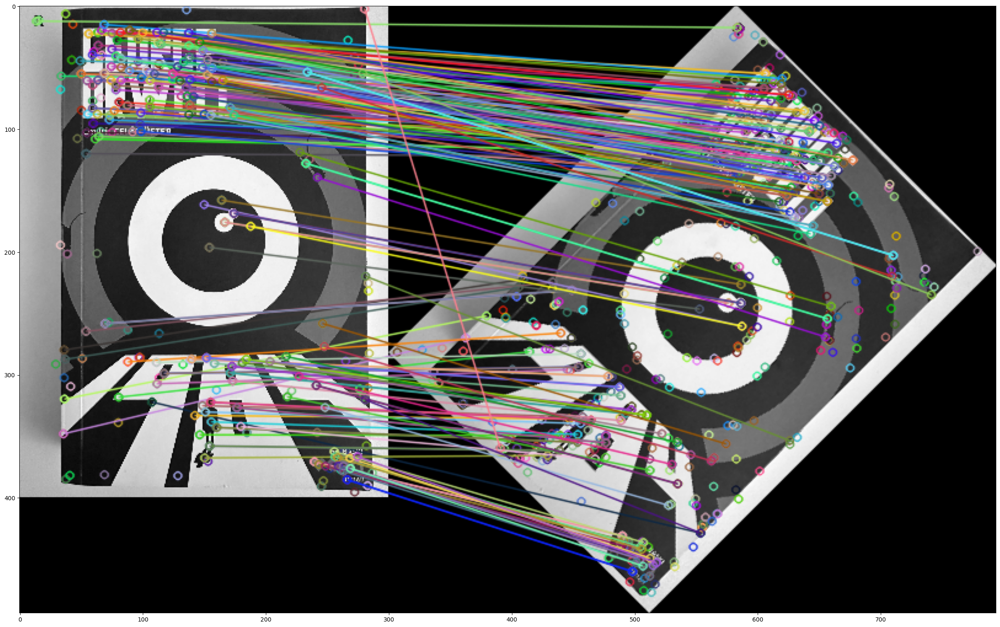
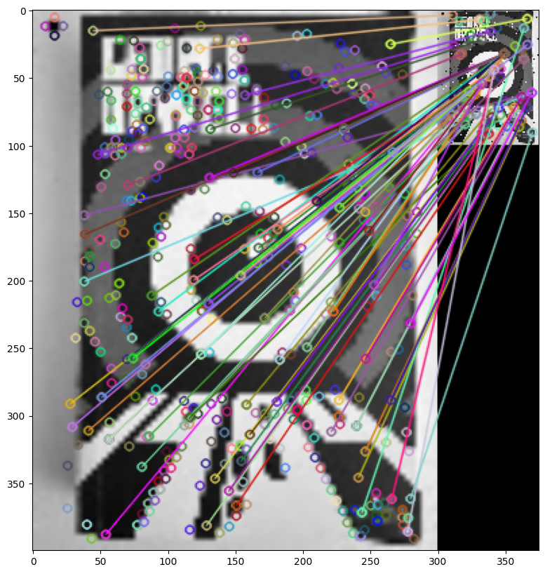
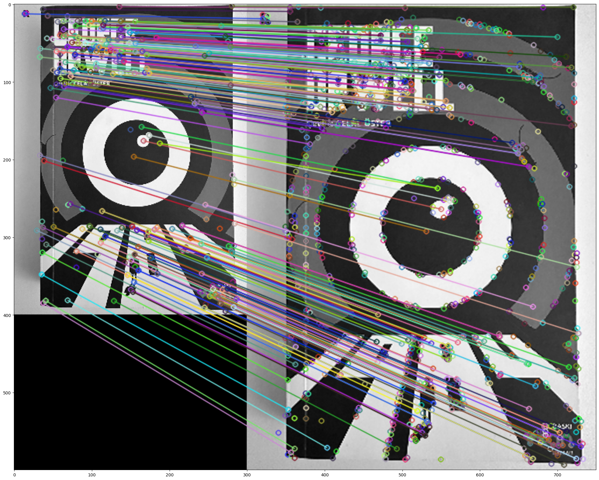

# Başlangıç

Günümüzde, görüntü işleme ve bilgisayarlı görüş alanında, görüntü hizalaması ve benzeri görevler büyük önem taşımaktadır. Görüntü hizalaması, farklı açılardan veya farklı koşullarda çekilen görüntülerin, bir referans görüntüye veya birbirlerine göre hizalanması anlamına gelir. Bu tür teknikler, birçok uygulama alanında kullanılmaktadır; örneğin, artırılmış gerçeklik, 3B modelleme, medikal görüntüleme ve görüntü üzerindeki nesnelerin tespiti gibi alanlarda sıklıkla başvurulan önemli bir işlemdir.

# GÖRÜNTÜ EŞLEŞTİRME TEKNİKLERİNİN GENEL BAKIŞI

## SIFT
SIFT (Scale-Invariant Feature Transform): SIFT, görüntülerdeki ölçek değişikliklerine karşı dayanıklı olan ve aynı zamanda dönüklük, rotasyon ve aydınlatma değişikliklerine karşı da istikrarlı sonuçlar veren bir özellik tanıma algoritmasıdır. Bu algoritma, görüntüdeki benzersiz özellikleri çıkarmak için ölçek uzayında özellik noktaları bulur ve bu özellikleri açıklayıcı vektörlerle temsil eder.

## ORB
ORB (Oriented FAST and Rotated BRIEF): ORB, hızlı ve etkili bir şekilde çalışabilen, özellikle gerçek zamanlı sistemler için ideal olan bir özellik tanıma algoritmasıdır. Hızlı özellik çıkarma ve eşleştirme yapabilme yeteneği, özellikle uygulama gereksinimleri düşünüldüğünde avantaj sağlar.

## Çalışmanın Kapsamı
Bu çalışma, SIFT ve ORB algoritmalarını, farklı görüntü hizalama senaryolarında karşılaştırarak, her bir algoritmanın performansını değerlendirmeyi amaçlamaktadır. Görüntüler arasındaki benzerlik ve uygunluk derecelerinin ölçülmesi, algoritmaların başarımını belirlemek için temel göstergeler olarak kullanılacaktır.
Çalışmanın ilerleyen aşamalarında, her bir algoritmanın kullanımıyla elde edilen sonuçlar incelenecek ve performansları, farklı deformasyonlar ve dönüşler altında nasıl değiştiği detaylı bir şekilde değerlendirilecektir.

  
  
  

# Sonuçlar
Yapılan deneylerden elde edilen sonuçlar aşağıda özetlenmiştir:

Rotasyon Etkisi:

- Makalede: Rotasyon açısının SIFT ve ORB algoritmalarının performansını etkilediği, özellikle SIFT'in 45 derece rotasyonda daha yüksek eşleştirme oranları sağladığı belirtilmiştir.
- Deney: Benim deneylerimde de, SIFT algoritmasının 45 derece rotasyonda ORB'den daha iyi bir performans gösterdiği görülmüştür.

Ölçeklendirme Etkisi:

- Makalede: Ölçeklendirme durumunda ORB algoritmasının en yüksek eşleştirme oranını sunduğu, SIFT'in ise daha düşük ancak kabul edilebilir bir oranda eşleştirme sağladığı belirtilmiştir.
- Deney: Benim deneylerimde de, SIFT algoritmasının ölçeklendirme durumunda daha yüksek eşleştirme oranları sunduğu gözlemlenmiştir.

Gürültülü Görüntülerin Etkisi:

- Makalede: Tuz ve biber gürültüsünün eşleştirme oranlarını etkilediği, ORB ve SIFT algoritmalarının bu durumda en iyi performansı sunduğu belirtilmiştir.
- Deney: Benim deneylerimde ise, gürültülü görüntülerde SIFT algoritmasının daha iyi bir performans gösterdiği, ORB algoritmasının ise gürültülü ortamda daha düşük bir performans sergilediği gözlemlenmiştir.

Bu sonuçlar, SIFT ve ORB algoritmalarının farklı koşullar altında farklı performanslar gösterdiğini ve bu algoritmaların birbirine göre avantaj ve dezavantajlarının bulunduğunu göstermektedir. Genel olarak, her iki algoritma da belirli koşullarda yüksek eşleştirme oranları sağlasa da, koşullar değiştikçe performanslarının da farklılık gösterdiği gözlemlenmiştir.

### TABLE I - Deney. 45 derece döndürülmeden çıkan değerler

| Süre (sn) | Kpnts1 | Kpnts2 | Match | Oran (%) |
|-----------|--------|--------|-------|----------|
| Sift      | 2,391  | 2561   | 2649  | 42.44    |
| Orb       | 0.97   | 6415   | 6185  | 20.05    |

### Table I - Makale. Results of Comparing the Image with Its Rotated Image

|        | Time (sec) | Kpnts1 | Kpnts2 | Matches | Match rate (%) |
|--------|------------|--------|--------|---------|----------------|
| SIFT   | 0.16       | 248    | 260    | 166     | 65.4           |
| SURF   | 0.03       | 162    | 271    | 110     | 50.8           |
| ORB    | 0.03       | 261    | 423    | 158     | 46.2           |

### TABLE II - Deney. Farklı dönme açılarında eşleşme oranları

| Açılar | 0   | 45   | 90   | 135  | 180  | 225  | 270  |
|--------|-----|------|------|------|------|------|------|
| Sift   | 100 | 42.44| 87.80| 42.63| 84.95| 41.74| 86.32|
| Orb    | 100 | 20.05| 62.14| 20.77| 49.51| 21.2 | 57.34|

### Table II - Makale. Matching Rate Versus the Rotation Angle

| Angle | 0    | 45   | 90   | 135  | 180  | 225  | 270  |
|-------|------|------|------|------|------|------|------|
| SIFT  | 100  | 65   | 93   | 67   | 92   | 65   | 93   |
| SURF  | 99   | 51   | 99   | 52   | 96   | 51   | 95   |
| ORB   | 100  | 46   | 97   | 46   | 100  | 46   | 97   |

### TABLE III - Deney. Gürültülü Görüntülerin Etkisi

| Süre (sn) | Kpnts1 | Kpnts2 | Match | Oran (%) |
|-----------|--------|--------|-------|----------|
| Sift      | 0,69   | 891    | 325   | 21,10    |
| Orb       | 1,04   | 6728   | 1288  | 5,10     |

### TABLE IV - Deney. Ölçeklendirme Etkisi

| Süre (sn) | Kpnts1 | Kpnts2 | Match | Oran (%) |
|-----------|--------|--------|-------|----------|
| Sift      | 2,43   | 4224   | 2649  | 38,38    |
| Orb       | 0,8    | 7225   | 6185  | 17,41    |